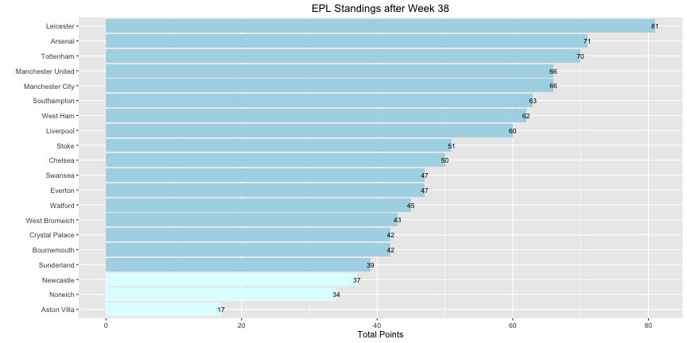
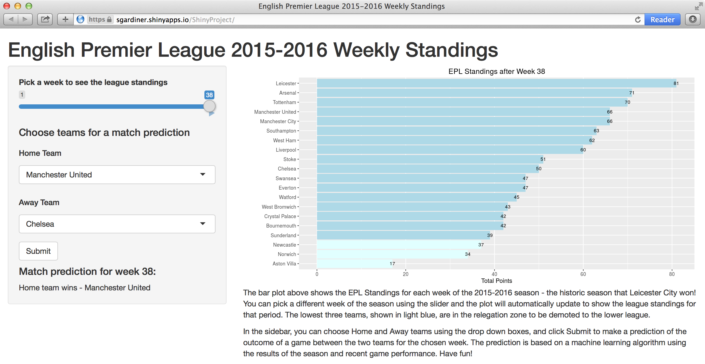

##  Shiny Project using Slidify
<h3>Coursera Data Products Course Project Presentation</h3>

Sam Gardiner

August 19, 2016

---

## Project Overview

For my project, I wrote a Shiny application that showed off data for the English Premier League (Football / Soccer) for the 2015-2016 season.  The season was historic, due to the victory by Leicester City, considered the biggest upset in English soccer history.  

This application shows the following:

1. A slider bar allowing the user to pick a week of the season
2. A bar plot showing the league standings for each team, reactively updating for the week chosen
3. Select boxes for the user to choose Home and Away teams for a game outcome prediction for the chosen week, activated by a Submit button
4. A prediction using a machine learning algorithm based on the season results and recent performance of the previous 5 games
5. Documentation on the application page that explains to the user how the widgets work, the details of the bar plot and how the prediction works

--- .class #id 

## Bar plot showing league standings

<h6>Plot generated using ggplot2</h6>

1. A horizontal bar plot is used to make the team names readable
2. Light blue color highlights the bottom 3 teams, which get relegated to a lower league at season's end

---

## Prediction function

<h5>Prediction algorithm</h5>

1. The standings.csv dataset, with week, Team, Home / Away and Cumulative Points was used as a starting point
2. Recent performance was added as a predictor by taking the mean of the outcomes of the previous 5 games
3. A machine learning approach was used for the prediction algorithm, using a Random Forests model, with k-folds = 5 for cross validation.

<h5>Prediction function</h5>

1. Inputs to the prediction function are the week chosen by the slider and the Home and Away teams chosen in the Select boxes
2. The prediction is activated by the Submit button
3. Outputs are the outcome points expected for each team.  The points are evaluated to predict a Home Win, Away Win or Draw.

---

## The Finished Project
</img>

<h6>The final project was an enjoyable finish to the course, incorporating the following technologies:</h6>

1. Shiny to create an R interactive web app
2. Slidify to create this html presentation
3. Machine learning prediction models from the previous class

Visit the Shiny project webpage - https://sgardiner.shinyapps.io/ShinyProject/

